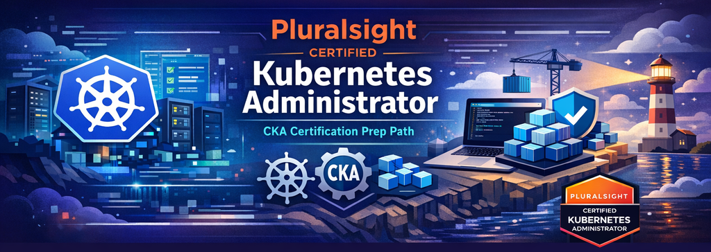
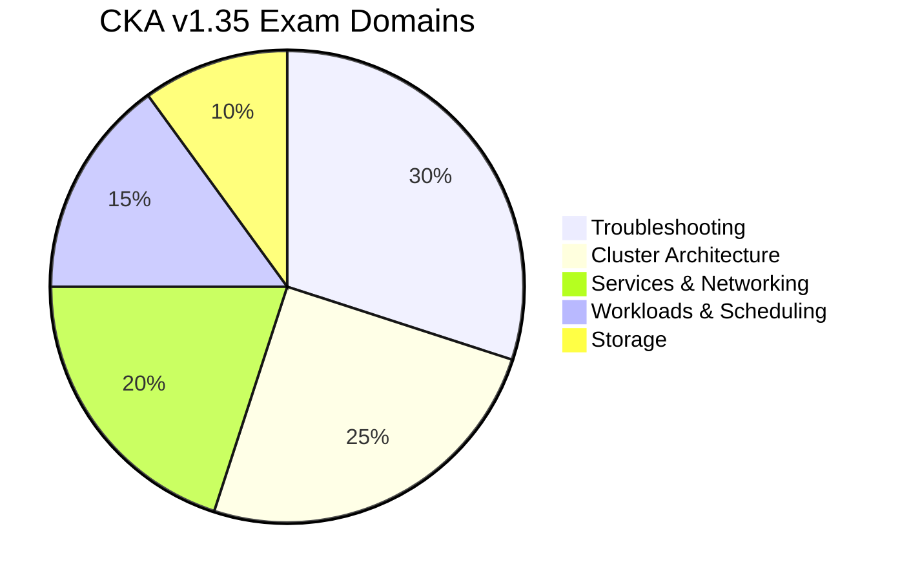

<div align="center">
  
</div>

# Certified Kubernetes Administrator (CKA) Skill Path

[](https://www.pluralsight.com/authors/tim-warner)
[](https://github.com/timothywarner)
[](https://techtrainertim.com)
[](LICENSE)
[](https://kubernetes.io)
[](https://training.linuxfoundation.org/certification/certified-kubernetes-administrator-cka/)

Exercise files and lab resources for the **Certified Kubernetes Administrator (CKA) v1.35 Skill Path** on [Pluralsight](https://www.pluralsight.com/authors/tim-warner).

Built from the ground up for the **February 2025 CKA curriculum revision** -- the largest update in CKA history -- covering Gateway API, Helm, Kustomize, CRDs/Operators, native sidecars, ephemeral containers, and expanded troubleshooting.

## Skill Path Overview

```mermaid
graph LR
    C1[1. Foundations] --> C2[2. kubeadm Install]
    C2 --> C3[3. Lifecycle & Upgrades]
    C3 --> C4[4. RBAC & Admission]
    C4 --> C5[5. Workloads & Scheduling]
    C5 --> C6[6. Storage]
    C6 --> C7[7. Services, Ingress & Gateway]
    C7 --> C8[8. Network Policies]
    C8 --> C9[9. Troubleshoot Clusters]
    C9 --> C10[10. Troubleshoot Workloads]
    C10 --> C11[11. Exam Prep]
```



| # | Course | CKA Domain | Est. Runtime |
|---|--------|-----------|--------------|
| 1 | Kubernetes Foundations | Cross-domain | 75 min |
| 2 | Installing Clusters with kubeadm | Architecture (25%) | 90 min |
| 3 | Managing Cluster Lifecycle and Upgrades | Architecture (25%) | 75 min |
| 4 | Securing Access with RBAC and Admission Controls | Architecture (25%) | 75 min |
| 5 | Managing Workloads and Scheduling | Workloads (15%) | 90 min |
| 6 | Managing Storage | Storage (10%) | 75 min |
| 7 | Services, Ingress, and Gateway API | Networking (20%) | 90 min |
| 8 | Network Policies and Traffic Management | Networking (20%) | 75 min |
| 9 | Troubleshooting Clusters and Nodes | Troubleshooting (30%) | 90 min |
| 10 | Troubleshooting Workloads and Services | Troubleshooting (30%) | 90 min |
| 11 | Exam Prep, Practice Labs, and Strategy | All domains | 75 min |

**Total runtime: ~15 hours** (10 core courses + 1 exam-prep capstone)

## CKA Exam Domain Weights



## Lab Environment Setup

All demos use **kind** (Kubernetes IN Docker) for reproducible, exam-aligned clusters that spin up in under 30 seconds.

### Prerequisites

- Windows 11 (23H2+) with WSL2, macOS, or Linux
- Docker Desktop 4.x (or Docker Engine on Linux)
- [kind](https://kind.sigs.k8s.io/) v0.25+
- kubectl v1.35

### Quick Start

```bash
# Clone the repo
git clone https://github.com/timothywarner/ps-cka.git
cd ps-cka/exercise-files

# Create the standard 3-node lab cluster (used across all courses)
kind create cluster --config shared/cka-lab-cluster.yaml --name cka-lab

# Verify cluster health
kubectl get nodes -o wide
kubectl -n kube-system get pods
```

### Standard Cluster Configuration

The same kind config is reused across all 11 courses:

```yaml
kind: Cluster
apiVersion: kind.x-k8s.io/v1alpha4
nodes:
- role: control-plane
  kubeadmConfigPatches:
  - |
    kind: InitConfiguration
    nodeRegistration:
      kubeletExtraArgs:
        node-labels: "ingress-ready=true"
  extraPortMappings:
  - containerPort: 80
    hostPort: 80
  - containerPort: 443
    hostPort: 443
  - containerPort: 30000
    hostPort: 30000
- role: worker
- role: worker
```

For **kubeadm-specific demos** (Course 2), a Vagrant + VirtualBox setup is used for full systemd and package management access.

## Repository Structure

```
exercise-files/
  course-01-foundations/
    m01-architecture-lab-setup/
    m02-kubectl-workflows/
    m03-core-resources-diagnostic-ladder/
  course-02-kubeadm-cluster-install/
    ...
  course-03-lifecycle-upgrades/
    ...
  ...
  course-11-exam-prep/
    ...
  shared/
    apps/
      catalog-api/
      fleet-dashboard/
      telemetry-worker/
  K8S/                    # Reference books (not tracked)
  reference-research/     # Research materials
```

Each module folder contains Kubernetes YAML manifests, shell scripts, and configuration files for hands-on demos and exercises.

## What's New in the February 2025 CKA Curriculum

This skill path natively covers topics added in the largest CKA revision to date:

- **Gateway API** -- GatewayClass, Gateway, HTTPRoute (replacing legacy Ingress)
- **Helm & Kustomize** -- Installing and managing cluster components
- **CRDs & Operators** -- Custom resources and the controller pattern
- **Workload Autoscaling** -- HPA and VPA configuration
- **Ephemeral Containers** -- `kubectl debug` for distroless image debugging
- **Native Sidecars** -- Init containers with `restartPolicy: Always`
- **Extension Interfaces** -- CNI, CSI, CRI plugin boundaries

## Storyline

All demos follow **Globomantics**, a fictional company migrating their monolithic e-commerce platform to Kubernetes. You've been hired as the first dedicated cluster administrator. Every skill maps to what you'll face on exam day and your first on-call rotation.

## Exam Resources

- [CKA Exam Registration ($445, includes retake + 2 killer.sh sessions)](https://training.linuxfoundation.org/certification/certified-kubernetes-administrator-cka/)
- [CKA Curriculum v1.35 (PDF)](https://github.com/cncf/curriculum)
- [Kubernetes Documentation](https://kubernetes.io/docs/) (allowed during exam)
- [Gateway API Documentation](https://gateway-api.sigs.k8s.io/) (allowed during exam)
- [Helm Documentation](https://helm.sh/docs/) (allowed during exam)
- [killer.sh Exam Simulator](https://killer.sh/)

## CKA Cert Buddy

This repo includes a **GitHub Copilot agent** for CKA exam practice in the [`cka-cert-buddy/`](cka-cert-buddy/) directory. Open it as a VS Code workspace to access:

- **Practice scenarios** -- exam-realistic tasks with two-phase delivery (scenario first, solution on request)
- **Guided labs** -- hands-on exercises on kind clusters with validation gates and cleanup
- **Study planner** -- personalized plans based on your confidence across the five exam domains
- **Reference docs** -- comprehensive command guide, exam lifecycle guide, and curated learning resources

See the [CKA Cert Buddy README](cka-cert-buddy/README.md) for setup instructions.

## Author

**Tim Warner** -- Microsoft MVP, Pluralsight author with 200+ courses, and technical trainer specializing in cloud infrastructure and certification preparation.

- [Pluralsight](https://www.pluralsight.com/authors/tim-warner)
- [GitHub](https://github.com/timothywarner)
- [Website](https://techtrainertim.com)

## License

This project is licensed under the MIT License -- see the [LICENSE](LICENSE) file for details.
