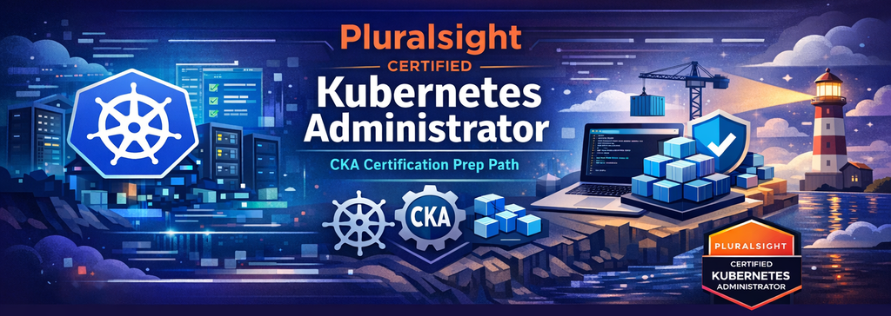
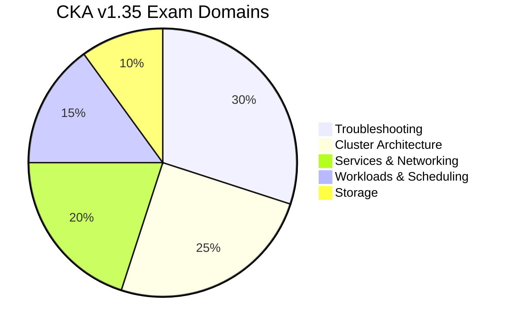

<div align="center">
  
</div>

# Certified Kubernetes Administrator (CKA) Skill Path

[](https://www.pluralsight.com/authors/tim-warner)
[](https://github.com/timothywarner)
[](https://techtrainertim.com)
[](LICENSE)
[](https://kubernetes.io)
[](https://training.linuxfoundation.org/certification/certified-kubernetes-administrator-cka/)

Exercise files and lab resources for the **Certified Kubernetes Administrator (CKA) v1.35 Skill Path** on [Pluralsight](https://www.pluralsight.com/authors/tim-warner).

Built from the ground up for the **February 2025 CKA curriculum revision** -- the largest update in CKA history -- covering Gateway API, Helm, Kustomize, CRDs/Operators, native sidecars, ephemeral containers, and expanded troubleshooting.

## Skill Path Overview


```mermaid
graph LR
    C1[1. Foundations] --> C2[2. kubeadm Install]
    C2 --> C3[3. Lifecycle & Upgrades]
    C3 --> C4[4. RBAC & Admission]
    C4 --> C5[5. Workloads & Scheduling]
    C5 --> C6[6. Storage]
    C6 --> C7[7. Services, Ingress & Gateway]
    C7 --> C8[8. Network Policies]
    C8 --> C9[9. Troubleshoot Clusters]
    C9 --> C10[10. Troubleshoot Workloads]
    C10 --> C11[11. Exam Prep]
```

| # | Course | CKA Domain | Est. Runtime | Status |
|---|--------|-----------|--------------|--------|
| 1 | [Kubernetes Foundations](exercise-files/course-01-foundations/README.md) | Cross-domain | 75 min | Recorded |
| 2 | [Installing Clusters with kubeadm](exercise-files/course-02-kubeadm-cluster-install/README.md) | Architecture (25%) | 90 min | Recorded |
| 3 | [Managing Cluster Lifecycle and Upgrades](exercise-files/course-03-lifecycle-upgrades/README.md) | Architecture (25%) | 75 min | Recorded |
| 4 | [Securing Access with RBAC and Admission Controls](exercise-files/course-04-rbac-admission/README.md) | Architecture (25%) | 75 min | Files shipped |
| 5 | [Managing Workloads and Scheduling](exercise-files/course-05-workloads-scheduling/README.md) | Workloads (15%) | 90 min | Coming as recorded |
| 6 | [Managing Storage](exercise-files/course-06-storage/README.md) | Storage (10%) | 75 min | Coming as recorded |
| 7 | [Services, Ingress, and Gateway API](exercise-files/course-07-services-ingress-gateway/README.md) | Networking (20%) | 90 min | Coming as recorded |
| 8 | [Network Policies and Traffic Management](exercise-files/course-08-network-policies/README.md) | Networking (20%) | 75 min | Coming as recorded |
| 9 | [Troubleshooting Clusters and Nodes](exercise-files/course-09-troubleshoot-clusters/README.md) | Troubleshooting (30%) | 90 min | Coming as recorded |
| 10 | [Troubleshooting Workloads and Services](exercise-files/course-10-troubleshoot-workloads/README.md) | Troubleshooting (30%) | 90 min | Coming as recorded |
| 11 | [Exam Prep, Practice Labs, and Strategy](exercise-files/course-11-exam-prep/README.md) | All domains | 75 min | Coming as recorded |

**Total runtime: ~15 hours** (10 core courses + 1 exam-prep capstone)

## Find your module's files

Every course folder has a **README** that maps each module to its files and CKA exam
objectives. Click a course above, then open the module you're watching. Recorded
courses (1-4) ship their manifests, scripts, and demo runbooks today; the rest land
as each module is recorded.

- **Course 1 -- Foundations:** [`exercise-files/course-01-foundations/`](exercise-files/course-01-foundations/README.md)
- **Course 2 -- kubeadm install:** [`exercise-files/course-02-kubeadm-cluster-install/`](exercise-files/course-02-kubeadm-cluster-install/README.md)
- **Course 3 -- Lifecycle and upgrades:** [`exercise-files/course-03-lifecycle-upgrades/`](exercise-files/course-03-lifecycle-upgrades/README.md)
- **Courses 4-11:** browse [`exercise-files/`](exercise-files/) -- each course and module folder carries its own README.

Naming is predictable: `exercise-files/course-NN-topic/mNN-module-name/`. The module
number matches the video module number in the Pluralsight player.

## CKA Exam Domain Weights


```mermaid
pie title CKA v1.35 Exam Domains
    "Troubleshooting" : 30
    "Cluster Architecture" : 25
    "Services & Networking" : 20
    "Workloads & Scheduling" : 15
    "Storage" : 10
```

## Lab Environment -- Two Paths

The lab environment lives in [`src/cka-lab/`](src/cka-lab/). It targets Kubernetes **v1.35** on a Windows 11 host.

### Hyper-V VMs with kubeadm

Best for: Course 2, anything that needs real systemd, a real package manager, or node-level break/fix drills. Three Ubuntu 22.04 VMs (`control1`, `worker1`, `worker2`) on a dedicated `CKA-NAT` switch (`192.168.50.0/24`). Vagrant brings them up with all kubeadm v1.35 prereqs installed -- you run `kubeadm init` yourself. Native Hyper-V checkpoints give you the practice loop.

```powershell
cd src/cka-lab
vagrant up --provider=hyperv   # admin pwsh required
.\Test-CkaLabReady.ps1         # confirm prereqs
.\Save-CkaSnapshot.ps1         # save "pre-cluster" baseline
vagrant ssh control1           # bootstrap the cluster yourself
.\Restore-CkaSnapshot.ps1      # nuke it, go again
```

Walkthrough -> [`src/cka-lab/TUTORIAL-HYPERV.md`](src/cka-lab/TUTORIAL-HYPERV.md)

### Prerequisites

- Windows 11 Pro/Enterprise (Hyper-V enabled) -- required for the exam-shaped path
- PowerShell 7+
- Docker Desktop 4.x with WSL2 -- for the fast path
- [kind](https://kind.sigs.k8s.io/) v0.25+, kubectl v1.35
- Vagrant -- for the exam-shaped path

## Repository Structure

```
exercise-files/
  course-01-foundations/
    m01-architecture-lab-setup/
    m02-kubectl-workflows/
    m03-core-resources-diagnostic-ladder/
  course-02-kubeadm-cluster-install/
    ...
  course-03-lifecycle-upgrades/
    ...
  ...
  course-11-exam-prep/
    ...
  shared/
    apps/
      catalog-api/
      fleet-dashboard/
      telemetry-worker/
  K8S/                    # Reference books (not tracked)
  reference-research/     # Research materials
```

Each module folder contains Kubernetes YAML manifests, shell scripts, and configuration files for hands-on demos and exercises.

## Pluralsight Course 1 Download

If you arrived here from a Pluralsight **Exercise Files** download, the file you grabbed (one of the pointers in [`docs/`](docs/)) is a signpost back to this repo. All manifests, lab scripts, and recording runbooks live here -- clone the repo and keep it open while you watch the videos.

## Recording Runbooks (Course 1)

Per-module demo runbooks for the Foundations course live in [`dev/`](dev/). Each includes pre-flight, camera checklist, click path, timed demos, reset-between-takes, and a recovery cheat sheet. They document the KIND-based tutorial flow that Course 1 was recorded against; those scripts are no longer in the repo, so read these as a record of what was recorded rather than as runnable instructions.

- [`dev/m01-demo-runbook.md`](dev/m01-demo-runbook.md) -- Architecture & Lab Setup (12-13 min)
- [`dev/m03-demo-runbook.md`](dev/m03-demo-runbook.md) -- Core Resources & Diagnostic Ladder (16-18 min)

## What's New in the February 2025 CKA Curriculum

This skill path natively covers topics added in the largest CKA revision to date:

- **Gateway API** -- GatewayClass, Gateway, HTTPRoute (replacing legacy Ingress)
- **Helm & Kustomize** -- Installing and managing cluster components
- **CRDs & Operators** -- Custom resources and the controller pattern
- **Workload Autoscaling** -- HPA and VPA configuration
- **Ephemeral Containers** -- `kubectl debug` for distroless image debugging
- **Native Sidecars** -- Init containers with `restartPolicy: Always`
- **Extension Interfaces** -- CNI, CSI, CRI plugin boundaries

## Storyline

All demos follow **Globomantics**, a fictional company migrating their monolithic e-commerce platform to Kubernetes. You've been hired as the first dedicated cluster administrator. Every skill maps to what you'll face on exam day and your first on-call rotation.

## Exam Resources

- [CKA Exam Registration ($445, includes retake + 2 killer.sh sessions)](https://training.linuxfoundation.org/certification/certified-kubernetes-administrator-cka/)
- [CKA Curriculum v1.35 (PDF)](https://github.com/cncf/curriculum)
- [Kubernetes Documentation](https://kubernetes.io/docs/) (allowed during exam)
- [Gateway API Documentation](https://gateway-api.sigs.k8s.io/) (allowed during exam)
- [Helm Documentation](https://helm.sh/docs/) (allowed during exam)
- [killer.sh Exam Simulator](https://killer.sh/)

## CKA Cert Buddy

This repo includes a **GitHub Copilot agent** for CKA exam practice in the [`cka-cert-buddy/`](cka-cert-buddy/) directory. Open it as a VS Code workspace to access:

- **Practice scenarios** -- exam-realistic tasks with two-phase delivery (scenario first, solution on request)
- **Guided labs** -- hands-on exercises with validation gates and cleanup
- **Study planner** -- personalized plans based on your confidence across the five exam domains
- **Reference docs** -- comprehensive command guide, exam lifecycle guide, and curated learning resources

See the [CKA Cert Buddy README](cka-cert-buddy/README.md) for setup instructions.

## Author

**Tim Warner** -- Microsoft MVP, Pluralsight author with 200+ courses, and technical trainer specializing in cloud infrastructure and certification preparation.

- [Pluralsight](https://www.pluralsight.com/authors/tim-warner)
- [GitHub](https://github.com/timothywarner)
- [Website](https://techtrainertim.com)

## License

This project is licensed under the MIT License -- see the [LICENSE](LICENSE) file for details.
