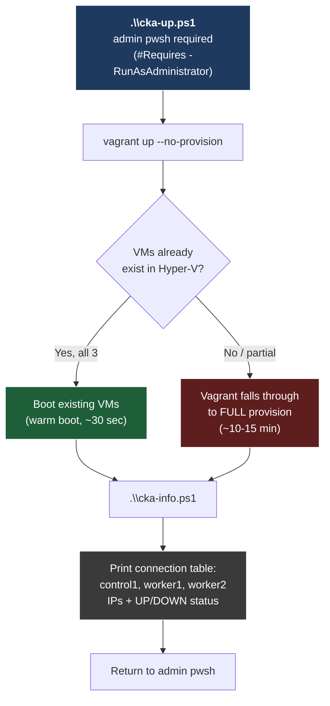
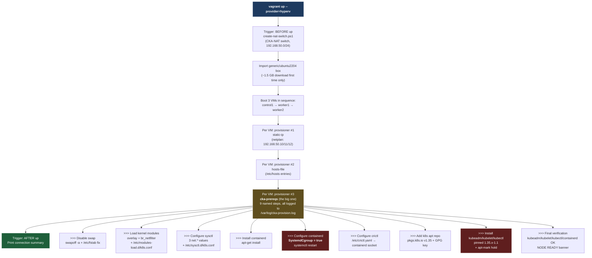

# CKA Course 2 / Module 1 — Preparing Linux Hosts for kubeadm

**Target runtime:** 12-14 min on camera
**Environment:** Admin pwsh 7 on Windows 11 → `vagrant ssh control1` (Ubuntu 22.04)
**Lab:** **Hyper-V + Vagrant** (NOT KIND) — `src/cka-lab` with control1, worker1, worker2 on `192.168.50.10/.11/.12`
**Authoritative command source:** Deck slides 7 / 12 / 13 / 15 show the install commands; `src/cka-lab/Vagrantfile` already ran them at `vagrant up` time. The demo VERIFIES state, doesn't install.
**Validator:** `src/cka-lab/cka-validate.ps1` (run from the Windows host; SSHes all three VMs in sequence)
**Cleanup between takes:** None — every check is read-only or idempotent. Snapshot to `m02-start` at the end and Module 2 starts from a known-good baseline.

> **Verify-first, not install-first.** The Vagrantfile provisioner already ran the full slides-7/12/13/15 install sequence on all three nodes at `vagrant up`. So the on-camera demo isn't "type the install commands" — it's "inspect the host and prove every prereq is correct." This is the same skill the CKA exam tests: handed a node that someone else prepared, can you verify it before bootstrapping? Show the deck slides for the install commands, then prove the state on the live VM. **Mention this on camera** with a one-liner like: "The install ran when these VMs booted — that's slides 7, 12, 13, 15 — so on camera we'll verify, the same skill the exam tests on a prepared node."

> **Lab path reminder:** This module uses the **Vagrant / Hyper-V** lab, not KIND. The `cka-*.ps1` scripts (`cka-up`, `cka-down`, `cka-status`, `cka-validate`, `cka-snapshot`, `cka-restore`, `cka-info`) are the Vagrant entry points. The `kind-*.ps1` scripts are for Course 1 only. Don't mix them.

> **Course 2 design principle:** This runbook has NO `Start-TutorialMXX` wrapper. Course 1 wraps kubectl drills in PowerShell tutorials because the value of those modules is *speed of reps*. Course 2's value is *unwrapped exposure to the real Linux shell* — typing every command yourself is the entire pedagogical bet.

---

## Slide-to-demo map (glance here mid-take to stay on pace)

| Slides | Block | What you're teaching | Time |
|---|---|---|---|
| 1-3 | Open + Globomantics frame | Course 2 reset (KIND → real VMs), four framing questions, Ravi hands you three bare hosts | ~90 sec |
| 4-7 | LO 1 → **Demo 1** (kernel/sysctl) | Two modules, three sysctls, persistence | ~3 min |
| 8-13 | LO 2 → **Demo 2 + Demo 3** (containerd + crictl) | CRI contract, `SystemdCgroup = true`, pin crictl to socket | ~4-5 min |
| 14-15 | LO 3 → **Demo 4** (packages) | Pin + hold, kubelet crashloop pre-`init` is healthy | ~2 min |
| 16-17 | LO 4 → **Demo 5** (validator) | Cross-node verification before bootstrap | ~2 min |
| 18 | Demo transition | "Time to put it into practice" | 10 sec |
| 19 | Globomantics checkout | Ravi signs off — every prereq confirmed | ~30 sec |
| 20 | From Globomantics to you | Four takeaways → Module 2 | ~45 sec |

---

## Pre-flight (run these BEFORE hitting record)

**Run from admin pwsh 7 on Windows.** Every line below is a literal command. Type or paste in order.

### Step 0 — Open admin pwsh and `cd` to the lab

```powershell
cd C:\github\ps-cka\src\cka-lab
```

### Step 1 — Confirm VM state (Vagrant/Hyper-V status probe)

```powershell
.\cka-status.ps1
```

**Expected:** all three VMs listed as `Running` with IPs `.10/.11/.12` reachable.
**If any VM is `Off` or `Saved`:** go to Step 2.
**If `cka-status.ps1` reports NO VMs at all** (Day 1 of recording or post-`vagrant destroy`): skip to Step 2b.

### Step 2 — Boot VMs (warm boot, no re-provision)

```powershell
.\cka-up.ps1
```

This wraps `vagrant up --no-provision` — fast, no provisioner re-run.

### Step 2b — Cold rebuild (ONLY if Step 1 said "no VMs found")

```powershell
vagrant up --provider=hyperv
```

~10-15 min cold, ~5 min on box cache. Provisioner runs the full prereq sequence.

### Step 3 — Sanity-check all prereqs across 3 VMs

```powershell
.\cka-validate.ps1
```

**Must end with:** `ALL NODES READY — safe to snapshot or run kubeadm init on control1`. If it doesn't, recording is blocked — fix before Step 4.

### Step 4 — Snapshot the pre-record state

```powershell
.\cka-snapshot.ps1 pre-record
```

Atomic checkpoint across all 3 VMs. A failed take = `cka-restore.ps1 pre-record` in ~60-90 sec.

### Step 5 — Dry-run the demo OFF camera

```powershell
vagrant ssh control1
```

Inside the VM, walk Demos 1-4 below. Confirm muscle memory. Idempotent re-runs are safe. Then `exit` twice to get back to admin pwsh.

### Camera checklist (final scan before recording)

- [ ] Admin pwsh, font 16pt+, 140 cols wide, prompt trimmed
- [ ] `.\cka-info.ps1` shows all 3 nodes **UP** with their `.10/.11/.12` IPs
- [ ] `.\cka-validate.ps1` ended with `ALL NODES READY`
- [ ] Only one terminal window visible — no chat apps, no notifications
- [ ] Screen recorder set to 1080p, no HiDPI blur, no taskbar
- [ ] Deck slide 5 (kernel modules table) open on second monitor for reference

---

## Click path (the exact ENTER sequence — high level)

1. `vagrant ssh control1` → ENTER → land at `vagrant@control1:~$`
2. `sudo -i` → ENTER → root prompt (see "Why root for the demo" below)
3. **Demo 1** — VERIFY kernel + sysctl state (5 read-only checks, see Demo 1 section)
4. **Demo 2** — VERIFY containerd + cgroup config (4 read-only checks, see Demo 2 section)
5. **Demo 3** — VERIFY crictl pinned to socket (4 read-only checks, see Demo 3 section)
6. **Demo 4** — VERIFY packages installed + held (3 read-only checks, see Demo 4 section)
7. `exit` → ENTER → back to `vagrant@control1:~$`
8. `exit` → ENTER → back to admin pwsh on Windows
9. **Demo 5** — `.\cka-validate.ps1` → ENTER (cross-node verifier)
10. **Snapshot** — `.\cka-snapshot.ps1 m02-start` → ENTER

**Total ENTERs:** ~25 across the whole module. Slow is smooth, smooth is fast.

**Why root for the demo:** several of the verification checks need root (read `/etc/containerd/config.toml`, query `crictl info`). Constantly prefixing `sudo` on camera adds visual noise. Open with: **"I'm going to `sudo -i` to keep the commands clean — in production you'd `sudo` each step."** Honest, fast, viewer-friendly.

**Pedagogical frame for the open:** "These three VMs already had the prereqs installed at boot time — that's slides 7, 12, 13, and 15 — by the Vagrant provisioner. On the exam, you'll be handed prepared nodes too. The job isn't 'type the install commands from memory.' The job is **prove the node is correct before you bootstrap.** That's what we're doing in this demo."

---

## Open — slides 1-3 (30-60 sec)

**Verbatim talk track:**

> "Infrastructure just handed Ravi at Globomantics three bare Ubuntu VMs. Root access, package mirrors configured, and a deadline — control plane up by end of day. Before he can type `kubeadm init`, every one of those nodes needs **four things in place**: kernel modules loaded, sysctl tuned, a container runtime with the right cgroup driver, and the Kubernetes packages installed and *pinned*. Skip any one and `kubeadm init` either fails with a cryptic error or, worse, succeeds and then fights you for the next six months. We're going to walk every prereq on a real Ubuntu shell, then run a cross-node verifier that proves all three nodes are exam-clean. Let's go."

**Slide 2 — Four framing questions:** read each beat-by-beat, don't pre-answer.
**Slide 3 — Globomantics check-in:** read Ravi's quote in character. Infrastructure Lead. End of day.

---

## Demo 1 — VERIFY kernel modules + sysctl (3 min)

**Goal:** Prove the two kernel modules and three sysctls — the entire **networking foundation** kubeadm depends on — are loaded AND persisted. Slide 7 shows the install commands. We verify the install landed.

### Step 1.1 — Confirm you're at the root prompt on control1

```bash
hostname && whoami
```

Expected: `control1` and `root`. If you see `vagrant`, you skipped `sudo -i`.

### Step 1.2 — Verify both modules are loaded in the running kernel

```bash
lsmod | grep -E 'overlay|br_netfilter'
```

**Windows lens:** `lsmod` is Linux's `driverquery` / `Get-WindowsDriver` — "which kernel-mode modules are loaded right now?" `grep -E` is `Select-String` with regex.

**Expected:** two lines back, `overlay` and `br_netfilter`. The "Used by" count on `br_netfilter` may be `0` until a bridge exists (CNI creates one later). Presence of the line is what matters; the counter is informational.

**Narrate:** "Both modules in the running kernel right now. `overlay` is what containerd uses to stack image layers. `br_netfilter` is what makes bridged Layer 2 traffic visible to iptables, which is how kube-proxy enforces Service rules and how CNI plugins enforce NetworkPolicies."

### Step 1.3 — Verify modules are persisted for next boot

```bash
cat /etc/modules-load.d/k8s.conf
```

**Windows lens:** `cat` is `Get-Content` / `type`. `/etc/modules-load.d/` is systemd's "drop-in folder" — vaguely like `HKLM\SYSTEM\CurrentControlSet\Services\*\Start=2` telling Windows "auto-load this driver at boot."

**Expected:** two lines — `overlay` and `br_netfilter`.

**Narrate:** "`lsmod` proves they're in the kernel *right now*. This file proves they're in the kernel *every boot from now on*. systemd reads `/etc/modules-load.d/` at startup and auto-loads every module listed in any `.conf` file under it. **Two-layer check: runtime AND persistence.** The exam will absolutely test both."

### Step 1.4 — Verify the three sysctls are set (right now)

```bash
sysctl net.ipv4.ip_forward net.bridge.bridge-nf-call-iptables net.bridge.bridge-nf-call-ip6tables
```

**Windows lens:** `sysctl` is Linux's `Set-NetIPInterface` + registry tunables in one tool — runtime kernel parameters you can read and write. Think `HKLM\SYSTEM\CurrentControlSet\Services\Tcpip\Parameters\IPEnableRouter` and friends; same concept, friendlier CLI.

**Expected:** all three return `= 1`.

**Narrate — slow down here:** "Three sysctls, three ones. `ip_forward` turns the host into a Layer 3 forwarder so pods on different nodes can route to each other. The two `bridge-nf-call-*` values make bridged Layer 2 traffic visible to iptables. All three are **zero on stock Ubuntu**, all three must be **one before `kubeadm init`**. A zero here is a silent killer — preflight passes, networking breaks later."

### Step 1.5 — Verify the sysctls are persisted under /etc/sysctl.d/

```bash
cat /etc/sysctl.d/k8s.conf
```

**Windows lens:** `/etc/sysctl.d/` is the "persistence" half — a drop-in folder applied at boot, same way Windows would persist a registry value vs. a one-shot `netsh` command that dies on reboot.

**Expected:** the three `net.*` lines, each set to `= 1`.

**Narrate:** "Same two-layer pattern. `sysctl` query proved the values are live; `/etc/sysctl.d/k8s.conf` proves they survive reboot. `sysctl --system` re-reads this directory at boot to apply every drop-in."

### Demo 1 money shot (verbatim — say this)

> "Two checks per setting: **is it set right now, and will it still be set after a reboot?** That's the exam pattern. The install commands on slide 7 — `modprobe`, `tee`, `sysctl --system` — are how you GET here. These five `lsmod`, `cat`, and `sysctl` queries are how you PROVE you're here. Memorize both directions."

### Demo 1 exam tip (verbatim)

> "CKA loves testing the `/etc/sysctl.d/` path. If they give you a misbehaving cluster where pods on different nodes can't reach each other, the **first thing to check** is `sysctl net.bridge.bridge-nf-call-iptables` — that one parameter is the difference between iptables seeing your bridged pod traffic and iptables ignoring it. Value of `1` means it's working. Value of `0` means kubeadm's preflight check passed but cluster networking is broken in a way that'll take you 40 minutes to diagnose under exam pressure."

---

## Demo 2 — VERIFY containerd + cgroup driver alignment (3 min)

**Goal:** Prove containerd is running and configured with `SystemdCgroup = true` — the **single config flag** that causes more `kubeadm init` failures than every other prereq combined. Slide 12 shows the install/edit commands; we verify they landed.

### Step 2.1 — Verify containerd service is alive

```bash
systemctl status containerd --no-pager | head -10
```

**Windows lens:** `systemctl` is Linux's `Get-Service` / `sc.exe` — systemd is the Service Control Manager equivalent. `--no-pager` just means "don't shove output through `less`" (no `more` to press space through). `head -10` is `Select-Object -First 10`.

**Expected:** the `Active:` line reads `active (running)`, and the `Loaded:` line includes `enabled` confirming it auto-starts on boot.

**Narrate:** "**`active (running)`** on the Active line, service is alive. **`enabled`** on the Loaded line, it starts on boot. The `--no-pager` flag is the exam-day move; on a stock `systemctl status` the pager will eat your clock. Pipe to `head` or pass `--no-pager` every time."

### Step 2.2 — Verify the CRI socket responds (the runtime talks)

```bash
crictl info | head -20
```

**Windows lens:** `crictl` is like the `docker` CLI but pointed at a CRI socket instead of the Docker daemon — same "talk to the container engine directly" idea, lower in the stack than kubelet.

**Expected:** JSON output starting with `{` and showing `runtimeName`, `runtimeVersion`, and a `runtimeApiVersion` block.

**Narrate:** "The runtime *talks*. `crictl info` is the CRI's way of saying 'I'm here, here's my runtime version, here's my socket.' If this prints JSON, you have a working CRI-compliant runtime. If it errors with `connect: no such file or directory`, containerd's down — and `kubeadm init` will fail before it starts."

### Step 2.3 — Verify SystemdCgroup = true in the config (THE money line)

```bash
grep SystemdCgroup /etc/containerd/config.toml
```

**Windows lens:** **cgroups** (Linux control groups) are how the kernel meters CPU, memory, and PIDs per process — the closest Windows analogue is a **Job Object**. Linux has two cgroup drivers (`cgroupfs` and `systemd`); kubelet and containerd MUST agree on which one, the way two services on Windows must agree on the same SCM contract.

**Expected:** exactly one line back — `SystemdCgroup = true`.

**Narrate — slow down here:** "Here's the entire reason this module exists. **containerd ships with `SystemdCgroup = false` by default.** kubelet on every modern Linux distro uses `systemd` as its cgroup driver. Mismatch means kubelet *appears* to start, kubeadm init *appears* to succeed, and then pods crashloop with errors that point you at the wrong layer for hours. `grep` is how you prove the fix is in. **One line, five characters of difference, the entire cluster's health.**"

### Step 2.4 — Confirm containerd loaded that config

```bash
crictl info | grep -i systemd
```

**Expected:** a `"SystemdCgroup": true` line in the JSON config dump.

**Narrate:** "Belt and suspenders. The config file says `true`; this confirms containerd actually **loaded** that value into its runtime state. If you edit `config.toml` and forget to `systemctl restart containerd`, the file is right but the runtime is wrong. This check catches that."

### Demo 2 money shot (verbatim — say this)

> "This `SystemdCgroup` flag is the single most asymmetric trap in cluster install. Five characters in a config file. Get it right, the cluster comes up in 90 seconds. Get it wrong, you'll spend an afternoon Googling `kubelet crashloop` error messages that don't mention cgroups anywhere. **Memorize this line.** Tattoo it. The CKA exam expects you to fix this without looking it up."

### Demo 2 exam tip — CRI-O parallel (verbatim)

> "CRI is the *abstraction* — the interface kubelet talks to. **containerd** is one implementation; **CRI-O** is another. The exam can test you on either. The cgroup-driver problem exists on both — different file, same root cause. If you see CRI-O in the exam, the file is `/etc/crio/crio.conf` and the directive is `cgroup_manager = \"systemd\"`. Same fight, different battlefield."

---

## Demo 3 — VERIFY crictl pinned to runtime socket (1-2 min)

**Goal:** Prove `/etc/crictl.yaml` exists and points at containerd's socket — small file, huge exam payoff. Slide 13 shows the install command; we verify the file is right and crictl is silent.

### Step 3.1 — Verify the crictl config file exists and points at containerd

```bash
cat /etc/crictl.yaml
```

**Windows lens:** `unix:///run/containerd/containerd.sock` is a **Unix domain socket** — the Linux equivalent of a Windows **named pipe** (`\\.\pipe\docker_engine` is how Docker Desktop talks on Windows). Same idea: local IPC over a filesystem path, no TCP port.

**Expected:** two lines — `runtime-endpoint: unix:///run/containerd/containerd.sock` and `image-endpoint: unix:///run/containerd/containerd.sock`.

**Narrate:** "**Why this file matters:** `crictl` is the lower-level cousin of `kubectl`. Where `kubectl` talks to the API server, `crictl` talks directly to the CRI runtime — past Kubernetes, straight to containerd. Without `/etc/crictl.yaml`, crictl scans common paths and prints a deprecation warning every time. **Two lines, runtime endpoint and image endpoint, both pointing at containerd's Unix socket. Tiny file, massive quality-of-life upgrade during a 2-hour exam.**"

### Step 3.2 — Confirm crictl runs cleanly with no deprecation warnings

```bash
crictl info | head -5
```

**Expected:** clean JSON header, no `WARN[...] runtime connect using default endpoints` warning above it.

**Narrate:** "**Notice what's NOT there** — no deprecation warning. Without `/etc/crictl.yaml`, every crictl invocation would print 'using default endpoints, this will be deprecated' across the top. **Silence is the proof.**"

### Step 3.3 — Verify no containers yet (expected at this stage)

```bash
crictl ps
```

**Expected:** empty list (just the header row, no container rows).

**Narrate:** "Empty — no containers running, because there's no cluster yet. Kubelet's crashlooping (we haven't run `kubeadm init`), and crashlooping kubelet means no pods. That's expected. **Empty here is healthy at this stage.**"

### Step 3.4 — Verify no images cached yet

```bash
crictl images
```

**Expected:** empty list.

**Narrate:** "Also empty. Module 2's `kubeadm init` will pull the control-plane images here — pause, etcd, apiserver, scheduler, controller-manager, kube-proxy. **Then this list will populate.** It's a useful before/after to show on camera."

### Demo 3 pro tip (verbatim)

> "Add `alias k=kubectl` and `alias c=crictl` to your `.bashrc` on day one of exam prep. By the end of the first practice cluster you won't remember what the long versions look like. Muscle memory wins minutes."

**Windows lens:** `.bashrc` is bash's per-user startup script — the Linux `$PROFILE`. `alias k=kubectl` is `Set-Alias k kubectl` in your pwsh profile. Same purpose, different syntax.

---

## Demo 4 — VERIFY kubeadm, kubelet, kubectl pinned + held (2 min)

**Goal:** Prove the three packages are installed at the pinned version AND held against `apt upgrade`. Slide 15 shows the install/hold commands; we verify both landed.

### Step 4.1 — Verify all three packages are installed at the pinned version

```bash
dpkg -l kubeadm kubelet kubectl | grep ^hi
```

**Windows lens:** `dpkg` is Debian's package database — closest Windows analogue is `Get-Package` or `winget list`. The two-character status prefix is **desired action + current state** in one glyph:

| Prefix | Means | When you'd see it |
|---|---|---|
| `ii` | install desired, installed | Normal installed package, free to upgrade |
| `hi` | **hold** desired, installed | Pinned via `apt-mark hold` — `apt upgrade` will skip it |
| `rc` | remove, config-files only | Uninstalled but config left behind |
| `un` | unknown, not installed | Package was never on the system |

Our Vagrant provisioner runs `apt-mark hold kubelet kubeadm kubectl` (slide 15, step Demo 4.2 below), so all three packages show `hi`, not `ii`. **Filtering for `ii` would return zero matches on a correctly prepared node — the hold IS the lesson.**

**Expected:** three `hi` lines, each at `1.35.x-1.1` (where x is the patch — e.g., `1.35.5-1.1` on a current build).

**Narrate — slow down here:** "Three packages, identical version. That trailing `-1.1` is the Debian package revision — same Kubernetes 1.35 binary, packaged for the apt repo at `pkgs.k8s.io`. **Now look at the leftmost column — `hi`, not `ii`.** That `h` means **held**: someone — in our case, the Vagrant provisioner — ran `apt-mark hold` to lock these versions against the next `apt upgrade`. The `i` after it means installed. **`hi` is the correct exam-ready state**; if you ever see `ii` for these three packages, that's an unpinned cluster waiting to drift on the next patch window. We'll prove the hold itself in Step 4.2."

### Step 4.2 — Verify all three packages are held (the exam-day shield)

```bash
apt-mark showhold
```

**Windows lens:** `apt-mark hold` is "pin this package version" — same intent as a `winget pin add` or a WSUS approval rule that blocks an update. Without it, the next `apt upgrade` cheerfully replaces kubelet under your feet.

**Expected:** three lines back — `kubeadm`, `kubelet`, `kubectl`.

**Narrate:** "**Three packages on hold.** That's the magic word — `hold`. Without it, the next time someone runs `apt upgrade -y` as part of a routine patch window, the cluster jumps from 1.35 to 1.36 silently, the API server restarts with a new minor version, and your `kubeadm upgrade` plan gets done **for** you, badly. Hold is the difference between deliberate upgrades and surprise upgrades."

### Step 4.3 — Verify swap is disabled (kubelet's hard requirement)

```bash
swapon --show
```

**Windows lens:** Linux **swap** is the Windows **pagefile** — disk-backed virtual memory. kubelet refuses to schedule against swap because the scheduler needs deterministic memory accounting; on Windows-side k8s, the pagefile gets the same side-eye for the same reason.

**Expected:** empty output. No lines means no active swap.

**Narrate:** "Empty is the right answer. `swapon --show` lists active swap areas — an empty list means swap is OFF, which is what kubelet requires. **Stock Ubuntu ships with swap on by default**, so this is something the provisioner had to actively disable in `/etc/fstab` and via `swapoff -a`. If `swapon --show` ever returns a line on a CKA node, fix it before `kubeadm init` or preflight kicks you out."

### Step 4.4 — Verify kubelet is enabled (crashlooping is by design)

```bash
systemctl is-enabled kubelet
systemctl is-active kubelet
```

**Windows lens:** `is-enabled` = `(Get-Service kubelet).StartType` (Automatic vs. Manual). `is-active` = `(Get-Service kubelet).Status` (Running vs. Stopped). Two orthogonal questions: "does it start on boot?" and "is it running right now?"

**Expected:** `enabled` from the first command. The second can return `inactive`, `activating (auto-restart)`, or `failed` — **all three are healthy at this stage**. systemd cycles through these states as kubelet tries and fails to start without its config files.

**Windows lens:** `Restart=always` in the kubelet unit file is the systemd equivalent of `sc.exe failure kubelet reset= 0 actions= restart/5000` on Windows. Same contract, same "die and try again" loop. The difference: systemd is loud about it (`activating (auto-restart)` is a real state); SCM hides recovery actions in Services.msc's Recovery tab.

**Narrate:** "**`enabled`** — kubelet starts on every boot. The active status can be `inactive`, `activating (auto-restart)`, or `failed` right now. **All three are healthy at this stage.** With no `kubeadm init` yet, there's no `/etc/kubernetes/kubelet.conf` for kubelet to read. systemd tries to start it, it dies in seconds, systemd tries again. After a few rapid failures, systemd's restart-burst limit kicks in and parks the unit at `inactive` until something triggers it. **Don't fix this crashloop.** It heals itself the moment Module 2 runs `kubeadm init` — `inactive` flips to `active` without anyone touching `systemctl start`. That before/after is one of the cleanest cause-and-effect arcs in the whole bootstrap sequence."

### Step 4.5 — Prove WHY kubelet can't start yet (~15 sec, optional but high-payoff)

```bash
ls /etc/kubernetes/ 2>/dev/null || echo "empty — kubeadm init hasn't run"
ls /var/lib/kubelet/config.yaml 2>/dev/null || echo "no config — kubelet has nothing to read"
```

**Windows lens:** `2>/dev/null` redirects stderr to the null device — the bash equivalent of `2>$null` in pwsh. `||` is "run the next command only if the previous one failed," same as pwsh's `||` chain operator (PS7+). Net effect: a clean fallback message instead of a noisy `No such file or directory` error.

**Expected:** both fall back to the `echo` message — `/etc/kubernetes/` doesn't exist yet, and `/var/lib/kubelet/config.yaml` isn't there either.

**Narrate:** "**Here's the proof for the previous step.** kubelet needs four things to start: a kubeconfig at `/etc/kubernetes/kubelet.conf`, a config YAML at `/var/lib/kubelet/config.yaml`, a bootstrap kubeconfig, and TLS certificates under `/var/lib/kubelet/pki/`. **None of them exist yet.** `kubeadm init` is what writes all four. That's the entire reason kubelet can be `enabled` but never reach `active`. The crashloop is *waiting for kubeadm to do its job* — and the moment that job runs in Module 2, the kubelet self-heals. Don't go troubleshooting a kubelet that's healthy by design."

### Demo 4 money shot (verbatim — say this)

> "`apt-mark hold` on all three packages, on **all three nodes**, is the difference between a stable cluster and a cluster that surprises you on a Tuesday morning. The exam will absolutely test you on `apt-mark hold` and `apt-mark unhold` because the *upgrade* process — which we cover in a later course — explicitly requires you to unhold, upgrade, re-hold. Memorize the verb."

### Demo 4 exam tip (verbatim)

> "When the exam says 'install kubeadm at version 1.X' — that's a **two-part** answer. Install AND hold. If you install without holding, you've technically done it, but you've left the cluster vulnerable to the kind of silent drift the exam is testing you on. Always type `apt-mark hold` as the second line. **Always.**"

---

## Demo 5 — Verify all three nodes from the host (2 min)

**Goal:** Hands-off prereq verification across the full cluster. This is the **answer** to framing question #4 from the deck.

### Step 5.1 — Exit root shell on control1

```bash
exit
```

You're back at `vagrant@control1:~$`.

### Step 5.2 — Exit SSH back to Windows

```bash
exit
```

You're back in admin pwsh on Windows.

### Step 5.3 — Confirm you're in the right directory

```powershell
pwd
```

Expected: `C:\github\ps-cka\src\cka-lab`. If not, `cd` there.

### Step 5.4 — Run the validator

```powershell
.\cka-validate.ps1
```

**Narrate while it runs:**

- "The script SSHes into all three VMs **one at a time** and pipes a bash validator over stdin. Why stdin and not `vagrant ssh -c`? Because **Windows OpenSSH truncates long inline commands** and swallows the exit code from the inner script. Stdin delivery avoids both. That's the kind of footgun you only discover after a script lies to you about a node's health."
- "**Nine categories per node, three nodes.** Static IP. Required binaries on PATH. Services active. Swap off. Kernel modules loaded. Sysctl values correct. **Containerd's `SystemdCgroup = true`** — that's the one from Demo 2. crictl pinned to the runtime socket — from Demo 3. Apt holds in place — from Demo 4."
- On the final summary: "**Every check passes across all three nodes.** Look at that bottom banner: **`ALL NODES READY — safe to snapshot or run kubeadm init on control1`**. That's the green light for Module 2."

### Demo 5 money shot (verbatim — say this)

> "This is the entire reason verification scripts exist. On a real production cluster you'll bring up nodes individually over weeks. By the time you're ready to bootstrap, you can't remember which nodes got which fixes. **The verifier doesn't care.** Run it, get a green light, move on. Run it, get a yellow light, fix the specific node. **No tribal knowledge, no checklists in your head — reproducible verification as code.** Bookmark the source: `src/cka-lab/lib/validate-node.sh`. Copy it. Adapt it. Make one for every cluster you build."

---

## Snapshot + slides 19-20 + close (1.5 min)

### Step 6.1 — Atomic checkpoint

```powershell
.\cka-snapshot.ps1 m02-start
```

**Snapshot narration (verbatim):**

> "Atomic Hyper-V checkpoint across all three VMs, named `m02-start`. **Atomic** means all three or none — if even one VM doesn't exist or already has that checkpoint, the script aborts before touching any of them. A partial snapshot is worse than no snapshot. Now Module 2 starts from a known-good baseline: every prereq verified, every node ready, zero cluster state. **One `cka-restore.ps1 m02-start` away from a clean dress rehearsal of `kubeadm init`.**"

### Slide 19 — Globomantics checkout (~30 sec)

Read Ravi's quote in character. He's confirming what your terminal just proved: kernel modules loaded, sysctl configured, containerd running with the right cgroup driver, packages pinned. **Now he's confident these hosts will not surprise us during `kubeadm init`.**

### Slide 20 — From Globomantics to you (~45 sec)

Read the four takeaways off the slide and **add the exam framing** on each:

1. **Kernel modules are non-negotiable.** On the exam, this is one `modprobe` + one `tee` away from passing. Don't skip it.
2. **Systemd cgroup alignment prevents silent failures.** `SystemdCgroup = true`. Number one cause of `kubeadm init` failures. Memorize the path: `/etc/containerd/config.toml`.
3. **Version pinning protects cluster stability.** `apt-mark hold kubeadm kubelet kubectl` — three packages, one command, every node.
4. **Verify every node before bootstrapping.** A bash script that runs slides 7/12/15 verification one-liners turns a manual pass into 30 seconds of typing.

### Final close (~30 sec, verbatim)

> "Three Ubuntu VMs walked through four prereq blocks: kernel modules and sysctl for the networking foundation, containerd with the **single most important config flag** in cluster install, crictl pinned to the runtime socket for exam-day sanity, and the Kubernetes packages installed *and held*. One cross-node verifier closes the loop — every check green. Ravi's three Globomantics nodes are ready to bootstrap. In Module 2 we run `kubeadm init` on control1 and `kubeadm join` on the workers — the moment a pile of prepped Linux hosts becomes a cluster. See you there."

---

## Reset between takes

Every command in this module is idempotent. A failed take doesn't require a teardown — just re-run.

### Fast rewind (most common)

```powershell
.\cka-restore.ps1 pre-record
```

~60-90 sec. Back to the pre-record snapshot from Pre-flight Step 4.

### Redo Demo 5 only (no SSH needed)

```powershell
.\cka-validate.ps1
```

### Nuke everything and rebuild from absolute zero

```powershell
vagrant destroy -f
vagrant up --provider=hyperv
```

~10-15 min full rebuild. Use only when restore can't recover (e.g. checkpoint corrupted).

### Snapshot library to build during dry-runs

```powershell
.\cka-snapshot.ps1 pre-record       # baseline before each take
.\cka-snapshot.ps1 m02-start     # after Demo 5 — Module 2's starting point
```

---

## Recovery cheat sheet

| Symptom | Likely cause | Fix |
|---|---|---|
| `vagrant ssh control1` hangs at the prompt | VM is `Saved`, not `Running` | `.\cka-up.ps1` from admin pwsh first |
| `cka-status.ps1` shows no VMs at all | Day 1 of recording, or post-`vagrant destroy` | `vagrant up --provider=hyperv` (~10-15 min cold, ~5 min on box cache) |
| `sudo: command not found` for any tool | Provisioner didn't complete on this VM | `vagrant provision control1` re-runs the installer idempotently |
| `crictl info` errors with `permission denied` on the socket | You're running as `vagrant`, not `root` — skipped `sudo -i` from the click path | `sudo -i` then re-run. The containerd socket is `0660 root:root` by design |
| `dpkg -l ... \| grep ^ii` returns empty but packages ARE installed | Packages are **held** (`hi` prefix), not plain installed (`ii`) | Use `grep ^hi` (or `grep -E '^[ih]i'`) — see Step 4.1's status-prefix table |
| `crictl info` errors with `connect: no such file or directory` | containerd not running | `sudo systemctl start containerd` — then root-cause via `journalctl -xeu containerd` |
| `kubectl` works on the host but not inside the VM | Expected — no `~/.kube/config` until `kubeadm init` in Module 2 | Not a problem. Don't fix it. |
| `cka-validate.ps1` shows a single FAIL on one node | Drift on that VM | `vagrant ssh <node>` → re-run the relevant Demo 1-4 block on that node only |
| Apt repo errors (`pkgs.k8s.io` 403/404) | Network or VPN interfering with HTTPS to k8s.io | Check VPN, then `sudo apt-get update` — if fixed, re-run from Demo 4 |
| `(activating)` kubelet from Demo 4 becomes `inactive (dead)` | systemd gave up after restart budget | `sudo systemctl reset-failed kubelet && sudo systemctl start kubelet` — still crashloops, still healthy |
| "Subnet 192.168.50.0/24 already routed via interface ..." | Another Vagrant env, Docker bridge, WSL2 distro, or VPN owns the subnet | Free the subnet or edit `$Subnet`/`$GatewayIP` in `create-nat-switch.ps1` |
| "Host key verification failed" on SSH | Fresh VMs got new keys; `~/.ssh/known_hosts` has stale fingerprints | `ssh-keygen -R 192.168.50.10` + `.11` + `.12` |

---

## Source mapping

- **Live commands:** Deck slides 7 (kernel/sysctl), 12 (containerd), 13 (crictl), 15 (packages). One-to-one with what you type on camera.
- **Validator:** `src/cka-lab/cka-validate.ps1` (PowerShell wrapper) → `src/cka-lab/lib/validate-node.sh` (the 9 bash checks). Edit the bash if you want to add a check; the wrapper picks it up automatically.
- **VM provisioner** (off-camera, ran once at `vagrant up`): `src/cka-lab/Vagrantfile` — same commands as the demo, baked into a shell provisioner. **That's why every command in the demo is idempotent.**
- **Snapshot helpers:** `src/cka-lab/cka-snapshot.ps1` and `src/cka-lab/cka-restore.ps1` — atomic, all-or-nothing across the three VMs.
- **Vagrant lab walkthrough (deeper context):** `src/cka-lab/TUTORIAL-HYPERV.md`.
- **Deck source:** `m01-linux-host-prep_TimEdits-WindowsFriendly.pptx` (this module's directory). Open in PowerPoint for slides and speaker notes.

---

## Appendix — How the lab scripts work (mermaids)

### `cka-up.ps1` — what happens when you boot the lab



**Key insight:** `--no-provision` is the safety. On already-built VMs it's a fast boot (~30 sec). On missing/half-built VMs, Vagrant ignores `--no-provision` and runs the full provisioner anyway. That's why the first `cka-up` after a fresh `vagrant destroy` takes 10-15 min — it's secretly a `vagrant up` with full provisioning.

---

### What `vagrant up` actually does (the provisioner pipeline)



**Key insight:** Every command on deck slides 7, 12, 13, and 15 corresponds to one of the `>>>` steps inside the `cka-prereqs` provisioner. Slide 7 = G2 + G3. Slide 12 = G4 + G5. Slide 13 = G6. Slide 15 = G7 + G8. **That's the contract between the lecture and the lab.** Vagrant runs them at boot; the demo verifies they landed.

---

*Three Ubuntu VMs. Four prereqs. One verifier. The moment between bare-metal and cluster.*
